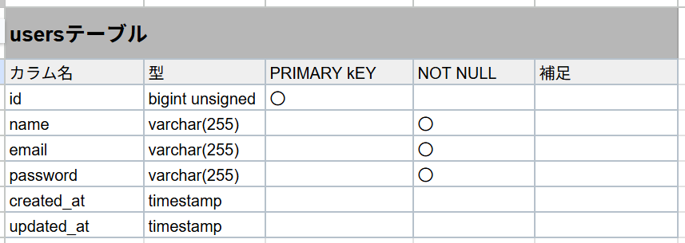
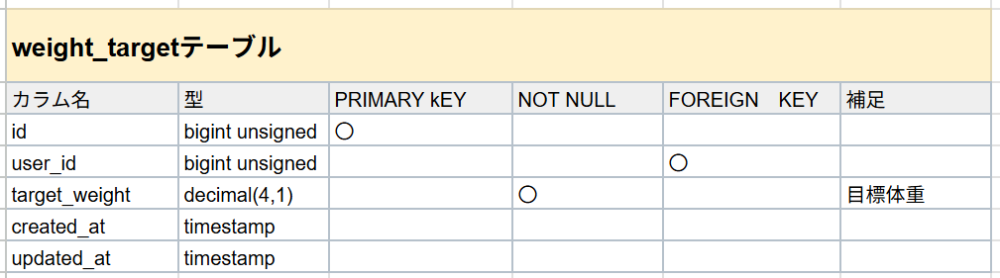
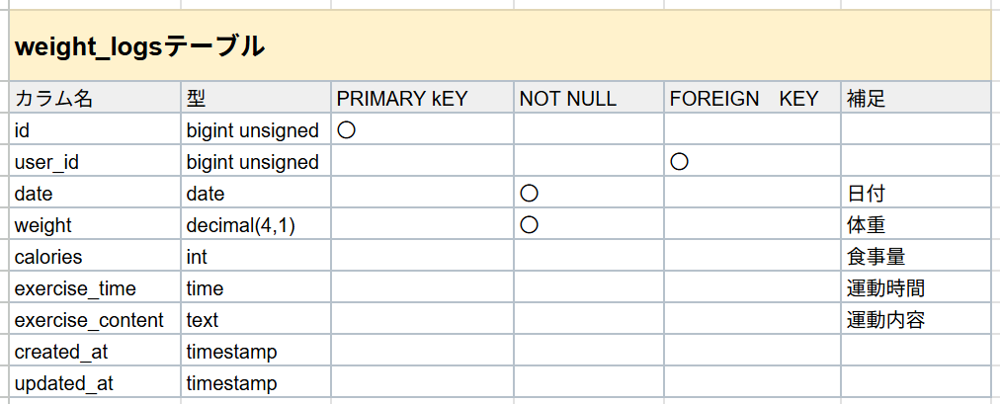
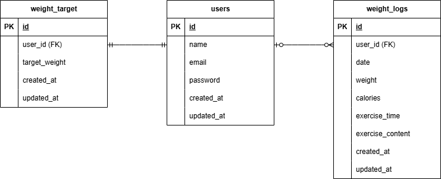

# 確認テスト　ピグリー

## 環境構築

リポジトリの設定

    ・　公開されているクローン元のリンク（SSH）をCodeボタンから取得

    ・　git clone リンク
            （コマンド実行後、lsで確認）

Docker の設定

    ・　docker-compose up -d --build

    ・　code .

    ・　docker-compose.yml の修正
            (1行目のversionをコメントアウト⇒修正後はコンテナ再構築)

Laravel のパッケージのインストール

    ・　docker-compose exec php bash

    ・　composer install
            （composer -vでインストールの確認）

.env ファイルの作成

    ・　cp .env.example .env

    ・　.envファイルの編集
            （Laravelのプロジェクトとデータベースを接続⇒修正後はキャッシュクリア）

view ファイルの作成

    ・　viewファイルの作成

    ・　php artisan make:controller

    ・　web.phpの修正

    ・　php artisan key:generate

マイグレーションの実行

    ・　php artisan make:model [モデル名] -m
            (マイグレーションテーブルとモデルを同時作成)

    ・　マイグレーションファイルの編集

    ・　php artisan migrate

ダミーデータの作成

    ・　php artisan make:factory

    ・　php artisan make:seeder

    ・　作成したシーダーファイルをDatabaseSeeder.phpに登録

    ・　php artisan db:seed

## 使用技術

バージョン情報

    ・　ubuntu 24.04.2 LTS (GNU/Linux 6.6.87.1-microsoft-standard-WSL2 x86_64)

    ・　Docker Desktop 4.44.2

    ・　php:8.1-fpm

    ・　Laravel 8.83.29

    ・　Composer 2.8.10
            PHP version 8.1.33 (/usr/local/bin/php)

    ・　MySQL 8.0.26

開発言語

    ・　HTML5・CSS

    ・　Laravel PHP

    ・　Command Line

    ・　MySQL

    ・　JavaScript（モーダル画面）

##　テーブル仕様書

## ER 図

## URL

開発環境 http://localhost/

phpMyAdmin http://localhost:8080/
